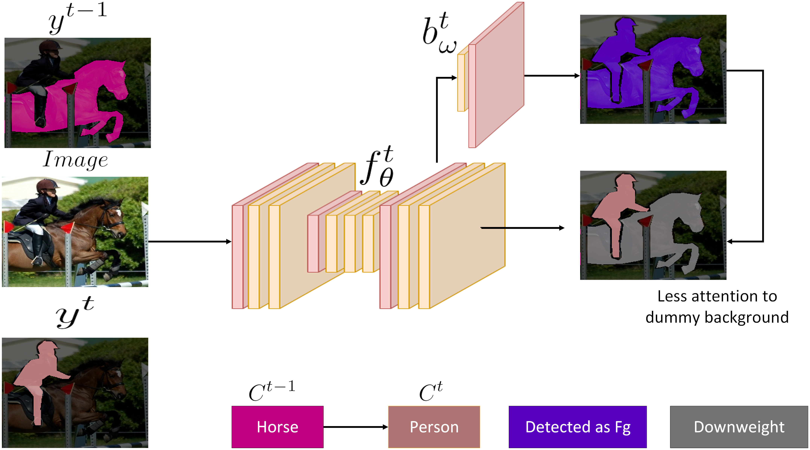
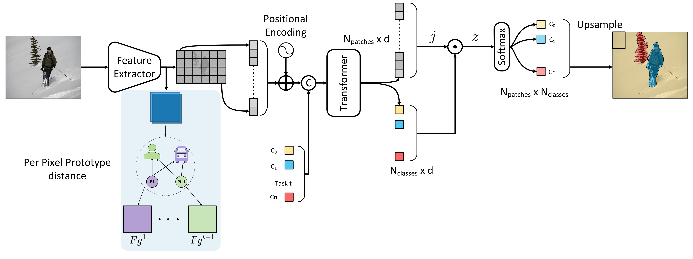

# BACS: Background Aware Continual Semantic Segmentation


A novel framework that uses foreground class prototypes along with dark experience replay to alleviate both catastrophic forgetting and background shift in semantic segmentation (where old classes are having ground truth background in future tasks). 


## Getting Started

These instructions will get this project up and running on your machine.

### Prerequisites

Install the requirements 

```
pip3 install -r requirements.txt
```

Install In place ABN to use faster activation batchnorm
```
    git clone https://github.com/mapillary/inplace_abn.git SLURM_TMPDIR
    cd SLURM_TMPDIR/inplace_abn
    python setup.py install
```
## Side Note

Any parameter in config can be overridden in cmd for example experiment name can be changed using 

```
  python main.py --config-path [config_path] --config-name [config_name] +training.exp_name=[placeholder] 
```
## Running the experiments

Handling of the configuration is done using [Hydra Framework](https://hydra.cc/), inside [conf](conf/) folder we have 2 example configuration 1 for joint training and the other one for continual learning.
Next, we explain how to write the configuration of each sub-folder

## dataset

### CityScape

Cityscape dataset with the following arguments

#### Arguments

* _target_: specify the main class name to instantiate it automatically using hydra
* dataset: parent including dataset specific config for that class
* root: root directory to download the data
* num_classes: number of classes of the dataset
* username: username used for cityscape
* password: cityscape password
* crop_size: image size used as a pre-processing

### VOC 

Pascal VOC 2012 dataset with the following arguments

#### Arguments

* _target_: specify the main class name to instantiate it automatically using hydra
* dataset: parent including dataset specific config for that class
* root: root directory to download the data
* num_classes: number of classes of the dataset
* crop_size: image size used as a pre-processing

## loss 

Contains configuration for loss function from (loss)[loss/] folder

### Arguments

* _target_: Class Name in the format loss. CLASSNAME
* name: name of the loss used for logging purposes

## network

Folder including yaml files to instantiate the network used

### UNET 

Can be used to instantiate a UNET network

#### Arguments

* _target_: networks. UNet
* n_channels: number of input channels
* bilinear: the interpolation used 

### deep_lab

Used to instantiate DeepLab network

#### Arguments

* _target_: networks. DeepLabV3 
* progress: flag for progress bar
* norm: norm used with its activation can be bn for batch norm and ReLU activation, iabn_sync (multi gpu synchronized in place activated batchnorm), iabn (incplace activated batch norm) and abn (activated batch norm).
* pretrained_backbone: flag to pre-train the backbone * ResNet-101 only # backbone pretrained
* backbone_weights_path: to load backbone pretrained weights from disk when pretrained flag is enabled
* atrous_encoder: to use atrous encoder as the one used in SDR deeplab v3+

## optimizer and scheduler

Includes configuration for the optimizer and scheduler in their folders respectively used

### Arguments

* -_target_: Optimizer base class
* any extra param used as input to the optimizer base class

## Training

### Joint
used to train sequentially all the classes as a single task 

#### Arguments

* name: joint
* exp_name: name of the experiment on wandb and file structure otherwise default naming will be used
* batch_size: batch size used for the training
* epochs: number of total epochs
* num_workers: number of workers used for the data loaders
* val_every: when to do the validation every n epochs
* seed: initial seed for the training
* scheduler_interval: scheduling interval can be step or epoch
* scheduler_frequency: frequency of scheduler
* log_images: to log images and predicted masks 
* debug: will use only 3 iterations per epoch to debug code.
* n_gpus: specify number of gpus for training
* mixed_precision: flag to enable 16bit mixed precision training
* apex: flag to use apex as a backend for mixed precision instead of native.
* ckpt_dir: directory to save checkpoints for resume, otherwise current working directory will be used
* bg_detector: to enable background detector based on auxiliary network that detect seen/unseen based on distance from prototypes
* steps_per_class: number of training steps per each class as in ReCall paper set to 1500 steps per class regardless of its # batches

### Continual

used to train continually the input dataset using same joint parameters plus

#### Arguments

* name: continual
* initial_increment: initial number of classes to start with
* increment: number of classes per upcoming task
* mode: disjoint # can be overlap disjoint sequential
* shuffle_classes: used to shuffle order of classes for task setup
* next_epochs: used to define number of epochs for new tasks (use epochs arg. if not set)

##### Mode

* Sequential: where for a given task T, with current classes C, the model sees all images that contain at least one pixel labeled as a current classes C. If the image contains future classes, yet unseen, then it is discarded. In the sequential setting, all pixels are labeled, either with an old or current class label, background label (0), or unknown label (255).

* Disjoint: It’s the same scenario as Sequential, but on one point. An image’s pixel is only labeled for the current classes. Therefore, during training, if an old class is present in the image, its labels would be 0 (aka background). However, during the test phase, all labels (current + old) are present.

* Overlap: It’s the same scenario as Disjoint except that the model can also see images containing a future class, as long as a current class is present.

## config.yaml

is the main configuration file that reference all the previous sub-configuration and can be overriden using cmd

```
defaults:
  - dataset: folder
  - network: unet
  - optimizer: nesterov
  - scheduler: exponential
  - training: continual
  - loss: crossentropy
```

# Run main.py 

Check (launch.json)[.vscode/launch.json] for the command used to init a run.

## References

```
@Misc{Yadan2019Hydra,
  author =       {Omry Yadan},
  title =        {Hydra - A framework for elegantly configuring complex applications},
  howpublished = {Github},
  year =         {2019},
  url =          {https://github.com/facebookresearch/hydra}
}

@incollection{NEURIPS2019_9015,
title = {PyTorch: An Imperative Style, High-Performance Deep Learning Library},
author = {Paszke, Adam and Gross, Sam and Massa, Francisco and Lerer, Adam and Bradbury, James and Chanan, Gregory and Killeen, Trevor and Lin, Zeming and Gimelshein, Natalia and Antiga, Luca and Desmaison, Alban and Kopf, Andreas and Yang, Edward and DeVito, Zachary and Raison, Martin and Tejani, Alykhan and Chilamkurthy, Sasank and Steiner, Benoit and Fang, Lu and Bai, Junjie and Chintala, Soumith},
booktitle = {Advances in Neural Information Processing Systems 32},
editor = {H. Wallach and H. Larochelle and A. Beygelzimer and F. d\textquotesingle Alch\'{e}-Buc and E. Fox and R. Garnett},
pages = {8024--8035},
year = {2019},
publisher = {Curran Associates, Inc.},
url = {http://papers.neurips.cc/paper/9015-pytorch-an-imperative-style-high-performance-deep-learning-library.pdf}
}

 @inproceedings{Cermelli_Mancini_Rota Bulo_Ricci_Caputo_2020, place={Seattle, WA, USA}, title={Modeling the Background for Incremental Learning in Semantic Segmentation}, ISBN={978-1-72817-168-5}, url={https://ieeexplore.ieee.org/document/9157089/}, DOI={10.1109/CVPR42600.2020.00925}, abstractNote={Despite their effectiveness in a wide range of tasks, deep architectures suffer from some important limitations. In particular, they are vulnerable to catastrophic forgetting, i.e. they perform poorly when they are required to update their model as new classes are available but the original training set is not retained. This paper addresses this problem in the context of semantic segmentation. Current strategies fail on this task because they do not consider a peculiar aspect of semantic segmentation: since each training step provides annotation only for a subset of all possible classes, pixels of the background class (i.e. pixels that do not belong to any other classes) exhibit a semantic distribution shift. In this work we revisit classical incremental learning methods, proposing a new distillation-based framework which explicitly accounts for this shift. Furthermore, we introduce a novel strategy to initialize classifier’s parameters, thus preventing biased predictions toward the background class. We demonstrate the effectiveness of our approach with an extensive evaluation on the Pascal-VOC 2012 and ADE20K datasets, significantly outperforming state of the art incremental learning methods. Code can be found at https://github.com/fcdl94/MiB.}, booktitle={2020 IEEE/CVF Conference on Computer Vision and Pattern Recognition (CVPR)}, publisher={IEEE}, author={Cermelli, Fabio and Mancini, Massimiliano and Rota Bulo, Samuel and Ricci, Elisa and Caputo, Barbara}, year={2020}, month={Jun}, pages={9230–9239} }

 @article{Douillard_Chen_Dapogny_Cord_2020, title={PLOP: Learning without Forgetting for Continual Semantic Segmentation}, url={http://arxiv.org/abs/2011.11390}, abstractNote={Deep learning approaches are nowadays ubiquitously used to tackle computer vision tasks such as semantic segmentation, requiring large datasets and substantial computational power. Continual learning for semantic segmentation (CSS) is an emerging trend that consists in updating an old model by sequentially adding new classes. However, continual learning methods are usually prone to catastrophic forgetting. This issue is further aggravated in CSS where, at each step, old classes from previous iterations are collapsed into the background. In this paper, we propose Local POD, a multi-scale pooling distillation scheme that preserves long- and short-range spatial relationships at feature level. Furthermore, we design an entropy-based pseudo-labelling of the background w.r.t. classes predicted by the old model to deal with background shift and avoid catastrophic forgetting of the old classes. Our approach, called PLOP, significantly outperforms state-of-the-art methods in existing CSS scenarios, as well as in newly proposed challenging benchmarks.}, note={arXiv: 2011.11390}, journal={arXiv:2011.11390 [cs]}, author={Douillard, Arthur and Chen, Yifu and Dapogny, Arnaud and Cord, Matthieu}, year={2020}, month={Nov} }
 @article{Douillard_Chen_Dapogny_Cord_2021, title={Tackling Catastrophic Forgetting and Background Shift in Continual Semantic Segmentation}, url={http://arxiv.org/abs/2106.15287}, abstractNote={Deep learning approaches are nowadays ubiquitously used to tackle computer vision tasks such as semantic segmentation, requiring large datasets and substantial computational power. Continual learning for semantic segmentation (CSS) is an emerging trend that consists in updating an old model by sequentially adding new classes. However, continual learning methods are usually prone to catastrophic forgetting. This issue is further aggravated in CSS where, at each step, old classes from previous iterations are collapsed into the background. In this paper, we propose Local POD, a multi-scale pooling distillation scheme that preserves long- and short-range spatial relationships at feature level. Furthermore, we design an entropy-based pseudo-labelling of the background w.r.t. classes predicted by the old model to deal with background shift and avoid catastrophic forgetting of the old classes. Finally, we introduce a novel rehearsal method that is particularly suited for segmentation. Our approach, called PLOP, significantly outperforms state-of-the-art methods in existing CSS scenarios, as well as in newly proposed challenging benchmarks.}, note={arXiv: 2106.15287}, journal={arXiv:2106.15287 [cs]}, author={Douillard, Arthur and Chen, Yifu and Dapogny, Arnaud and Cord, Matthieu}, year={2021}, month={Jun} }
 
 @inproceedings{Michieli_Zanuttigh_2019, place={Seoul, Korea (South)}, title={Incremental Learning Techniques for Semantic Segmentation}, ISBN={978-1-72815-023-9}, url={https://ieeexplore.ieee.org/document/9022296/}, DOI={10.1109/ICCVW.2019.00400}, abstractNote={Deep learning architectures exhibit a critical drop of performance due to catastrophic forgetting when they are required to incrementally learn new tasks. Contemporary incremental learning frameworks focus on image classification and object detection while in this work we formally introduce the incremental learning problem for semantic segmentation in which a pixel-wise labeling is considered. To tackle this task we propose to distill the knowledge of the previous model to retain the information about previously learned classes, whilst updating the current model to learn the new ones. We propose various approaches working both on the output logits and on intermediate features. In opposition to some recent frameworks, we do not store any image from previously learned classes and only the last model is needed to preserve high accuracy on these classes. The experimental evaluation on the Pascal VOC2012 dataset shows the effectiveness of the proposed approaches.}, booktitle={2019 IEEE/CVF International Conference on Computer Vision Workshop (ICCVW)}, publisher={IEEE}, author={Michieli, Umberto and Zanuttigh, Pietro}, year={2019}, month={Oct}, pages={3205–3212} }

```